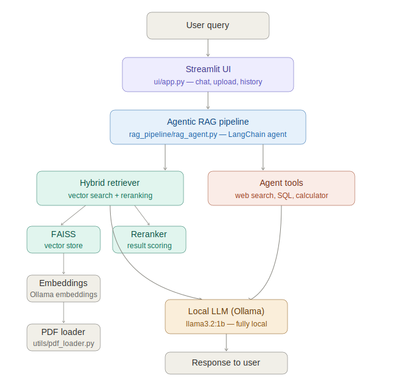

# 🤖 Agentic RAG AI Research Assistant


      
A powerful, locally-running AI research assistant built with **LangChain**, **Ollama**, and **Streamlit**. It combines Retrieval-Augmented Generation (RAG) with agentic tool use — letting you query your own documents, summarize them, and search the web, all from a sleek dark-themed UI.

---

## ✨ Features

- 📄 **Document Q&A** — Upload PDFs and ask questions grounded in your documents
- 📑 **Document Summarization** — Auto-summarize uploaded documents using LLM
- 🌐 **Web Search Mode** — Search the web and get AI-synthesized answers
- 🧠 **Hybrid Retrieval** — Combines vector search with reranking for accurate context
- 🗂️ **Conversation History** — Tracks your queries within the session
- 🖥️ **Fully Local** — Runs on your machine using Ollama (no OpenAI API needed)

---
## 📸 Screenshots
 
### 🏠 Home Page

 
### 📄 Document Summarization

 
### 🌐 Web Search


---
## 🏗️ Architecture



---

## 🗂️ Project Structure

```
agentic_rag_ai_research_assistant/
│
├── data/
│   ├── documents/          # Uploaded PDF documents
│   ├── vector_store/       # FAISS vector store index
│   └── database/           # SQL database files
│
├── embeddings/
│   └── embedding_model.py  # Embedding model setup
│
├── rag_pipeline/
│   └── rag_agent.py        # Core agentic RAG pipeline
│
├── retriever/
│   ├── hybrid_retriever.py # Hybrid retrieval logic
│   ├── reranker.py         # Result reranking
│   └── vector_store.py     # Vector store load/save
│
├── tools/
│   ├── calculator.py       # Calculator tool for the agent
│   ├── sql_tool.py         # SQL query tool
│   └── web_search.py       # Web search tool
│
├── ui/
│   └── app.py              # Streamlit frontend
│
├── utils/
│   ├── pdf_loader.py       # PDF loading and chunking
│   └── summarizer.py       # Document summarization helper
│
├── create_vector_db.py     # Script to build the vector store
└── requirements.txt        # Python dependencies
```

---

## 🚀 Getting Started

### 1. Clone the Repository

```bash
git clone https://github.com/YOUR_USERNAME/agentic_rag_ai_research_assistant.git
cd agentic_rag_ai_research_assistant
```

### 2. Create a Virtual Environment

```bash
python -m venv .venv
# Windows
.venv\Scripts\activate
# macOS/Linux
source .venv/bin/activate
```

### 3. Install Dependencies

```bash
pip install -r requirements.txt
```

### 4. Install and Run Ollama

Download Ollama from [https://ollama.com](https://ollama.com) and pull the required model:

```bash
ollama pull llama3.2:1b
```

### 5. Build the Vector Store

Place your PDF files in `data/documents/`, then run:

```bash
python create_vector_db.py
```

### 6. Launch the App

```bash
streamlit run ui/app.py
```

---

## 🛠️ Tech Stack

| Component | Technology |
|-----------|-----------|
| LLM | Ollama (`llama3.2:1b`) |
| Framework | LangChain |
| Vector Store | FAISS |
| Embeddings | LangChain Ollama Embeddings |
| Frontend | Streamlit |
| PDF Parsing | PyPDFLoader |
| Text Splitting | RecursiveCharacterTextSplitter |

---

## 📋 Requirements

- Python 3.10+
- [Ollama](https://ollama.com) installed and running locally
- Windows / macOS / Linux

---

## 🙏 Acknowledgements

- [LangChain](https://langchain.com)
- [Ollama](https://ollama.com)
- [Streamlit](https://streamlit.io)
- [FAISS](https://github.com/facebookresearch/faiss)
